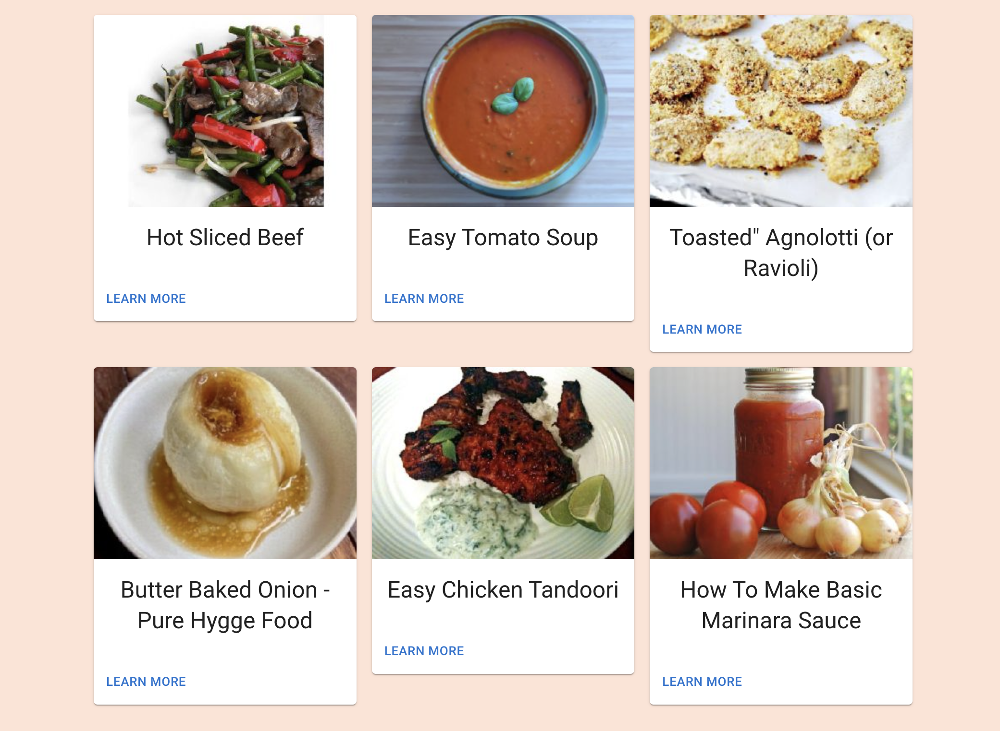

# Sustainabite

  
  

<h4 align="center">Sustainable meal planning made easy.</h4>
<h4 align="center">Project by: Tim Gubskiy, Martin Bardhi, and Ryan Lee</h4>

<h4 align="center">Live Demo at [seefood-af63f.web.app]</h4>

## What's the point?

Central to the development of our project was the health of other university students, and the creation of a resource to promote sustainable consumption decisions. According to a study from Stanford University, 40% of food goes uneaten and a sixth of all methane emissions are caused by food in landfills[^1]. Despite being a UN Sustainability Goal[^2] to have zero food waste by 2030, very little progress goes toward reducing wasted food. A massive problem such as food waste is one that requires effort from individuals to solve, since a majority of food waste are caused by individuals [^3]. Ultimately, our app aims to ensure complexity and time are not inhibiting factors in one's food purchasing decisions.

## How does your project help?

Our website takes a multifaceted approach towards reducing an individual's food waste.

Undoubtedly, a solution that requires high user effort to use would deter interest and be obsolete. Thus, our project receives the majority of its input directly from a camera mounted on the fridge. As you put an item into your fridge, we use computer vision to scan the barcode and direction of movement (Figure 1).

  
  <h4 align = "center"> Figure 1: Example of barcode scanning of yogurt for food inventory </h4> 

When you put an item in the fridge, if the barcode is visible, the website will add it to the list of ingredients available. As an ingredient approaches its expiry date, our website will send you a notification about its upcoming expiry (Figure 2) to ensure your items do not expire if you forgot about them. This ultimately reduces food waste through reminders.

  
  <h4 align = "center"> Figure 2: Screenshots of expiry messages from our website </h4> 

To further deliver on the promise of reducing time and complexity, our website recommends recipes based on your preferences (Figure 3). Since items that are used or expire are tracked, the website can recommend using items at risk of expiry, while analyzing items you have enjoyed in the past to promote better recipes. Moreover, recipe ratings are received from the user to further inform future recommendations. In order to ensure a healthy diet that works for each individual, we decided to track the macro nutrients of a user's consumption and preferred meal choices. According to multiple studies, the most integral part of a diet's efficacy is adherance [^4][^5]. Thus, by recommending recipes and diets according to the macro nutrients a user prefers, our website accounts for individuals sticking to a diet.

  
  <h4 align = "center"> Figure 3: Recommended recipes dependent on available ingredients </h4> 

  
  <h4 align = "center"> Figure 4: Step by step recipe instructions </h4> 

The data we track also allows us to create a recommended grocery list that correspond to a user's dietary preferences and favourite recipes.

  
  <h4 align = "center"> Figure 5: Recommended groceries based on user diet macro preferences </h4> 

## Technical Information:

Our code implements computer vision in python from OpenCV that uses an algorithm based on directional coherence to detect barcodes. In conjunction with UPCitemdb API, this barcode allows us to track detailed information about detected items. Furthermore, by tracking the change in position of an item, the website determines whether an item is entering the fridge or being taken out. Using this information, an item is added or removed from a list of food inventory. Food inventory is tracked using Firebase, along with a approximate expiry date. As the expiry date approaches, our website uses Twilio to notify users of perishing items through SMS. Furthermore, to increase data accuracy, a user's manual expiry input is tracked to improve the website's predictions for future estimated expiry dates.

In order to recommend recipes, the website calls Spoonacular API. Using our tracked food inventory, the website recommends recipes that optimizes the usage of nearly expiring items. We also created an algorithm that receives the data of the users preferred recipes and ingredients to track macro nutrients and create a grocery list, personalized for every user.

Our frontend is handled by React JS, and MUI for styling, hosted using Firebase.

## Built for simplicity, usability and responsiveness

Our project is built with the audience in mind. Through the intuitive UI, adaptive data analytics and helpful features of our software, our project achieves a goal to ultimately help the collective goal of zero food waste.

## What's next for Sustainabite?

We loved working on Sustainabite and we would love to improve our project further.

During the hackathon, an area we tried to explore was use Text to Speech and Speech to Text through Google Home and Alexa, but given the time constraints, our basic functionality was prioritized. Furthermore, our algorithm to recommend a grocery list could be improved to include the user's input as a parameter. Ultimately, this project has a long way to go in order to compete with industry standards. However, as an idea we thought of and implemented in 40 hours, we are proud of our project and excited to explore additional features that can truly make an impact.

## References

[^1]: https://earth.stanford.edu/news/when-food-waste-becomes-pollutant
[^2]: https://www.undp.org/sustainable-development-goals
[^3]: https://foodwastealliance.org/wp-content/uploads/2020/05/2015FWRAToolkit_Web_FINAL.pdf
[^4]: https://www.ncbi.nlm.nih.gov/pmc/articles/PMC4005268/
[^5]: https://www.ncbi.nlm.nih.gov/pmc/articles/PMC5618052
